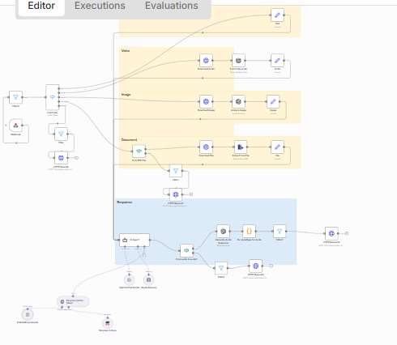

# 🗳️ Bot Élections Présidentielles Cameroun 2025 — Agent IA Multimodal

> Agent conversationnel IA spécialisé en politique camerounaise, capable de traiter des messages texte, vocaux, images et documents — déployé sur WhatsApp via n8n avec mémoire conversationnelle et base de connaissances interne.

---

## 📌 Présentation du projet

**"The Political Explainer"** est un agent IA développé à l'occasion des élections présidentielles camerounaises de 2025. Il rend l'information politique **accessible, claire et impartiale** pour tout citoyen, en répondant à ses questions par texte, voix, image ou document via WhatsApp.

L'agent s'appuie sur une **base de connaissances interne** sur la politique camerounaise, et génère des réponses simplifiées adaptées au niveau de chaque utilisateur — toujours dans la langue de la question posée (français ou anglais).

**Cas d'usage concret :** Un citoyen envoie un message vocal en français "C'est quoi le rôle du Conseil Constitutionnel ?" → le bot transcrit le message, interroge sa base documentaire, et répond avec une explication claire et neutre, personnalisée avec le prénom de l'utilisateur.

---

## 🏗️ Architecture du Workflow



### Description complète des nœuds

```
[WhatsApp Webhook]
        │  Réception du message entrant (texte, voix, image ou document)
        ▼
    [Filtre]  ◄── Validation du message
        │
        ▼
   [Router]  ◄── Détection du TYPE de message entrant
        │
        ├──── 🎤 VOIX ──────────────────────────────────────────────────┐
        │                                                               ▼
        │                                                  [Transcribe Audio 1]
        │                                                  Transcription WhatsApp Audio
        │                                                               │
        │                                                               ▼
        │                                                  [Transcribe Audio 2]
        │                                                  Nettoyage et formatage
        │                                                               │
        │                                                               ▼
        │                                                           [Note]
        │                                                  Texte prêt pour l'agent
        │
        ├──── 🖼️ IMAGE ─────────────────────────────────────────────────┐
        │                                                               ▼
        │                                                  [Download Media]
        │                                                  Téléchargement de l'image
        │                                                               │
        │                                                               ▼
        │                                                  [Analyze Image]
        │                                                  Analyse visuelle (Vision AI)
        │                                                               │
        │                                                               ▼
        │                                                           [Image]
        │                                                  Description prête pour l'agent
        │
        ├──── 📄 DOCUMENT ──────────────────────────────────────────────┐
        │                                                               ▼
        │                                                  [Binary/PDF File]
        │                                                  Lecture du fichier uploadé
        │                                                               │
        │                                                               ▼
        │                                                  [Extract Document Text]
        │                                                  Extraction du contenu textuel
        │                                                               │
        │                                                               ▼
        │                                                         [Document]
        │                                                  Texte prêt pour l'agent
        │
        └──── 💬 TEXTE ──────────────────────────────────────────────────┐
                                                                         │
                              ┌──────────────────────────────────────────┘
                              ▼
                   ════════ RESPONSE LAYER ════════
                              │
                              ▼
                       [AI Agent1]  ◄── "The Political Explainer"
                       Agent IA autonome spécialisé politique camerounaise
                              │
                    ┌─────────┴──────────────┐
                    ▼                        ▼
           [Fen. de contexte /      [Paramètre Vector /
            Simple Memory]          Base Documentaire]
           Mémoire de conversation  company_documents_tool
           (historique du fil)      Recherche dans la base
                                    de connaissances politique
                              │
                    ┌─────────┴──────────────┐
                    ▼                        ▼
              [Filter]                 [HTTP Request2]
              Validation               Envoi réponse
              de la réponse            via WhatsApp API
                    │
                    ▼
              [HTTP Request]
              Envoi alternatif
              (cas particuliers)
                              │
              ════════ MONITORING ════════
                              │
                              ▼
                   [Evaluate Our Results]
                   Évaluation de la qualité
                   des réponses générées
                              │
                              ▼
                      [Memory Policies]
                      Gestion des politiques
                      de mémoire et de contexte
```

---

## ✨ Fonctionnalités

| Fonctionnalité | Description |
|---|---|
| 📱 WhatsApp multimodal | Reçoit et traite texte, voix, images et documents |
| 🎤 Transcription vocale | Convertit les messages audio en texte pour analyse |
| 🖼️ Analyse d'images | Interprète les images envoyées par les citoyens (affiches, documents scannés) |
| 📄 Lecture de documents | Extrait et analyse le contenu des fichiers PDF et autres |
| 🧠 Agent IA spécialisé | "The Political Explainer" — expert politique camerounais |
| 📚 Base de connaissances interne | `company_documents_tool` — base documentaire sur la politique camerounaise |
| 💾 Mémoire conversationnelle | L'agent maintient le contexte sur toute la durée de la conversation |
| 🌍 Multilingue | Répond automatiquement dans la langue de l'utilisateur (FR/EN) |
| 👤 Personnalisation | Salue l'utilisateur par son prénom WhatsApp à la première interaction |
| ⚖️ Neutralité | Réponses impartiales et factuelles, sans spéculation ni parti pris |
| 📊 Monitoring | Évaluation automatique de la qualité des réponses générées |
| 🔁 Fallback intelligent | Si hors sujet : une réponse courte (≤20 mots) rappelant le rôle du bot |

---

## 🛠️ Technologies utilisées

| Technologie | Rôle |
|---|---|
| **[n8n](https://n8n.io/)** | Orchestration du workflow no-code/low-code |
| **WhatsApp Business API** | Canal de communication principal |
| **AI Agent (n8n)** | Cerveau du bot — orchestration des outils et génération de réponses |
| **Transcription Audio** | Conversion des messages vocaux en texte |
| **Vision AI** | Analyse et description des images reçues |
| **company_documents_tool** | Base de connaissances interne sur la politique camerounaise |
| **Simple Memory (n8n)** | Mémoire de conversation pour maintenir le contexte |
| **HTTP Requests** | Envoi des réponses via l'API WhatsApp |
| **Evaluate Node** | Monitoring et évaluation de la qualité des réponses |

---

## 🤖 Comportement de l'Agent IA

L'agent suit une logique stricte définie dans son prompt système :

```
1. Identifier le type de requête (politique ou hors-sujet)
2. Interroger la base company_documents_tool
3. Si résultats trouvés → explication simplifiée, claire et neutre
4. Si aucun résultat → 1 phrase de fallback (≤20 mots) avec son propre savoir
5. Si hors-sujet → 1 phrase courte (≤20 mots) rappelant son rôle politique
```

**Domaines couverts :** politique camerounaise, élections, lois, candidats, institutions (Conseil Constitutionnel, ELECAM, Assemblée Nationale...), biographies de personnalités politiques.

**Langues :** répond automatiquement en français ou en anglais selon la langue de l'utilisateur.

---

## 🌍 Contexte & Impact

Ce projet répond à un besoin réel au Cameroun : **rendre l'information électorale accessible à tous**, dans un contexte où la désinformation circule rapidement sur WhatsApp.

**Impact :**
- Disponible 24h/24, 7j/7 sans ressources humaines supplémentaires
- Accessible à tous les citoyens via WhatsApp (outil du quotidien)
- Réponses basées sur des sources documentaires vérifiées
- Interface vocale inclusive pour les personnes peu à l'aise avec l'écrit
- Support multilingue français/anglais pour toutes les régions du Cameroun

---

## 🚀 Comment utiliser ce projet

### Prérequis
- Un compte [n8n](https://n8n.io/) (cloud ou self-hosted)
- Une clé API OpenAI (pour l'agent IA et la transcription)
- Un accès à l'API WhatsApp Business (Meta for Developers)
- Une base de connaissances sur la politique camerounaise (documents PDF, JSON)

### Étapes d'installation

**1. Importer le workflow n8n**
```
- Ouvrir n8n
- Aller dans "Workflows" → "Import from file"
- Importer le fichier workflow.json présent dans ce repo
```

**2. Configurer les credentials**
```
- OpenAI : ajouter ta clé API (agent + transcription + vision)
- WhatsApp Business : ajouter le token Meta for Developers
- Configurer le webhook d'entrée dans Meta for Developers
```

**3. Alimenter la base de connaissances**
```
- Préparer tes documents sur la politique camerounaise (PDF, JSON, texte)
- Les connecter au nœud company_documents_tool dans n8n
- Tester une requête pour vérifier les résultats retournés
```

**4. Tester le bot**
```
- Envoyer un message texte : "Qui est le président du Cameroun ?"
- Envoyer un message vocal sur le même sujet
- Envoyer une image d'une affiche électorale
- Vérifier que les réponses sont cohérentes et neutres
```

---

## 📁 Structure du repo

```
bot-elections-cameroun-2025/
│
├── workflow.json                  # Export du workflow n8n complet
├── workflow-bot-election.PNG      # Capture d'écran du workflow
├── README.md                      # Documentation du projet
└── docs/
    └── prompt-system.md           # Prompt système complet de l'agent IA
```

---

## 👥 Auteurs

Projet développé par **[mboa-automation](https://github.com/mboa-automation)** :

- **Messoa Yene Stephane Erwan**
- **Bryan Vincent Mballa** 

---

## 📄 Licence

Ce projet est open source sous licence MIT — libre d'utilisation, modification et distribution.

---

## 🔗 Liens utiles

- [Documentation officielle n8n](https://docs.n8n.io/)
- [OpenAI API](https://platform.openai.com/docs/)
- [WhatsApp Business API](https://developers.facebook.com/docs/whatsapp)
- [ELECAM — Elections Cameroun](http://www.elecam.cm/)
- [n8n AI Agent Documentation](https://docs.n8n.io/integrations/builtin/cluster-nodes/root-nodes/n8n-nodes-langchain.agent/)

---

*Projet réalisé dans le cadre d'un engagement citoyen et d'un apprentissage pratique de l'automatisation IA — mboa-automation © 2025*
